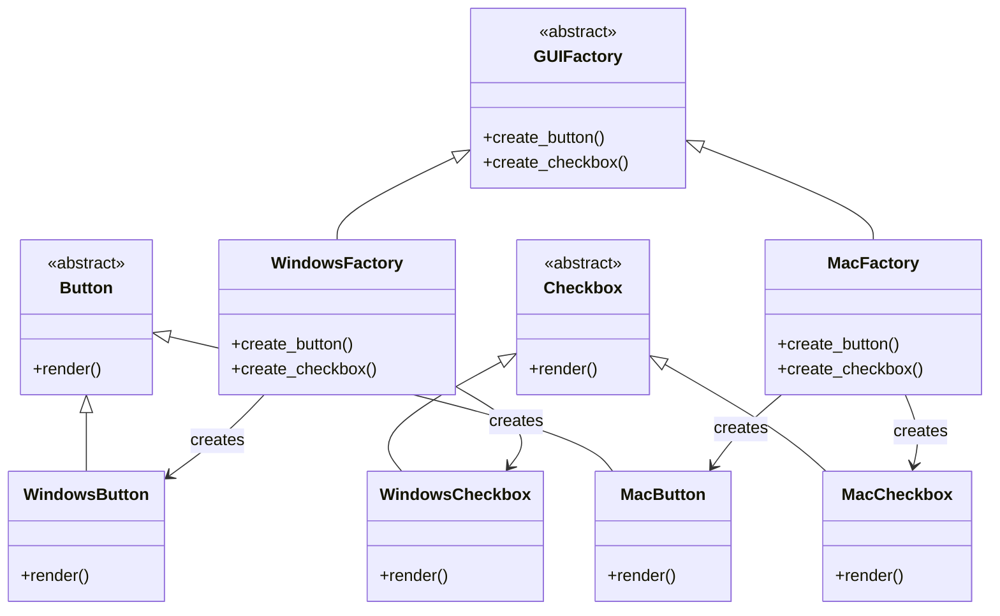

```mermaid
classDiagram

class Button {
  <<abstract>>
  +render()
}

class Checkbox {
  <<abstract>>
  +render()
}

class WindowsButton {
  +render()
}

class MacButton {
  +render()
}

class WindowsCheckbox {
  +render()
}

class MacCheckbox {
  +render()
}

class GUIFactory {
  <<abstract>>
  +create_button()
  +create_checkbox()
}

class WindowsFactory {
  +create_button()
  +create_checkbox()
}

class MacFactory {
  +create_button()
  +create_checkbox()
}

Button <|-- WindowsButton
Button <|-- MacButton

Checkbox <|-- WindowsCheckbox
Checkbox <|-- MacCheckbox

GUIFactory <|-- WindowsFactory
GUIFactory <|-- MacFactory

WindowsFactory --> WindowsButton : creates
WindowsFactory --> WindowsCheckbox : creates

MacFactory --> MacButton : creates
MacFactory --> MacCheckbox : creates
```