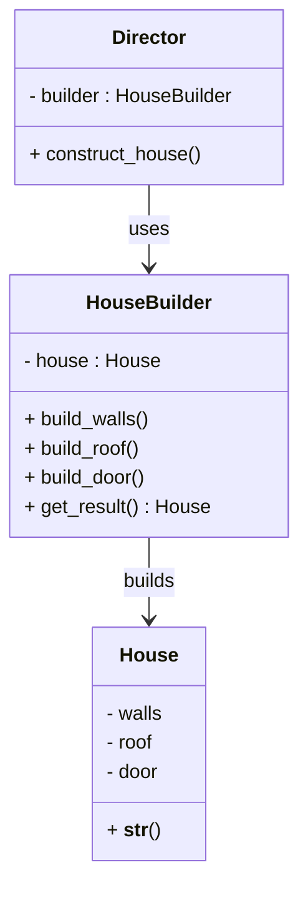

```mermaid
classDiagram

class House {
  - walls
  - roof
  - door
  + __str__()
}

class HouseBuilder {
  - house : House
  + build_walls()
  + build_roof()
  + build_door()
  + get_result() House
}

class Director {
  - builder : HouseBuilder
  + construct_house()
}

HouseBuilder --> House : builds
Director --> HouseBuilder : uses
```