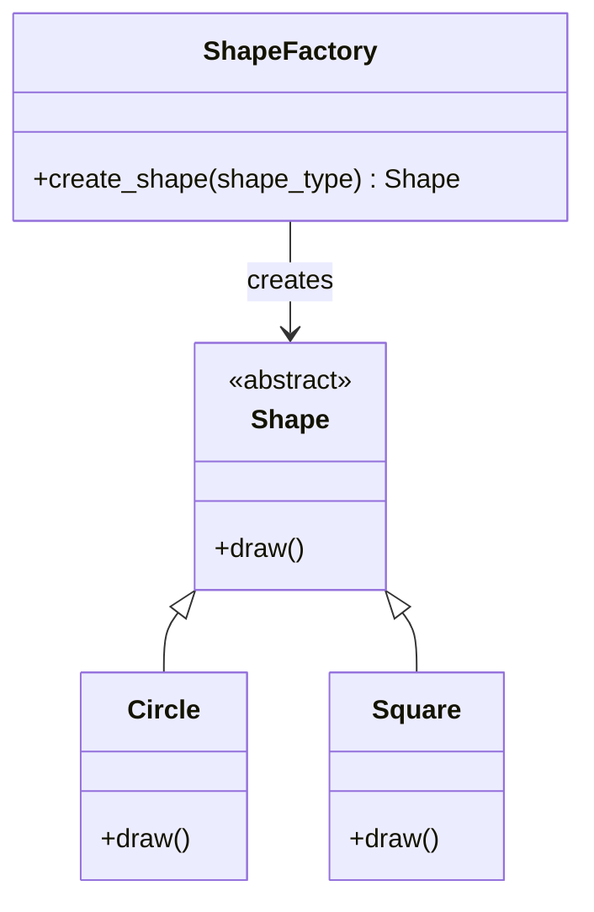

```mermaid
classDiagram

class Shape {
  <<abstract>>
  +draw()
}

class Circle {
  +draw()
}

class Square {
  +draw()
}

class ShapeFactory {
  +create_shape(shape_type) Shape
}

Shape <|-- Circle
Shape <|-- Square
ShapeFactory --> Shape : creates
```